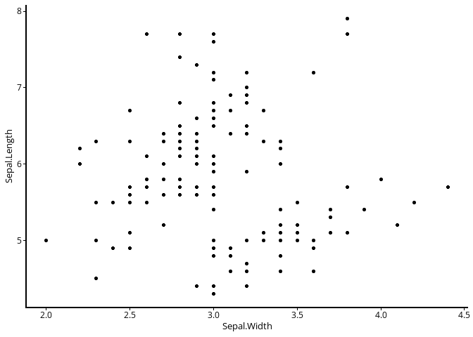
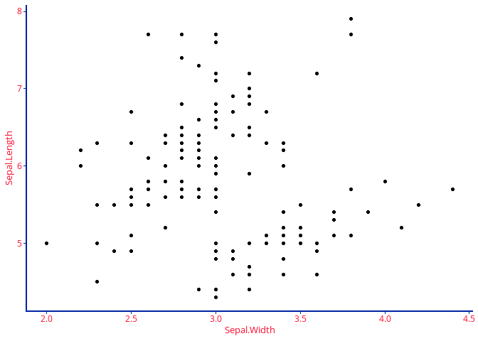
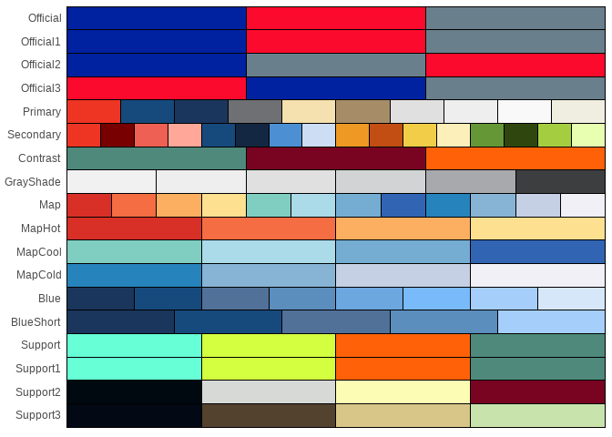
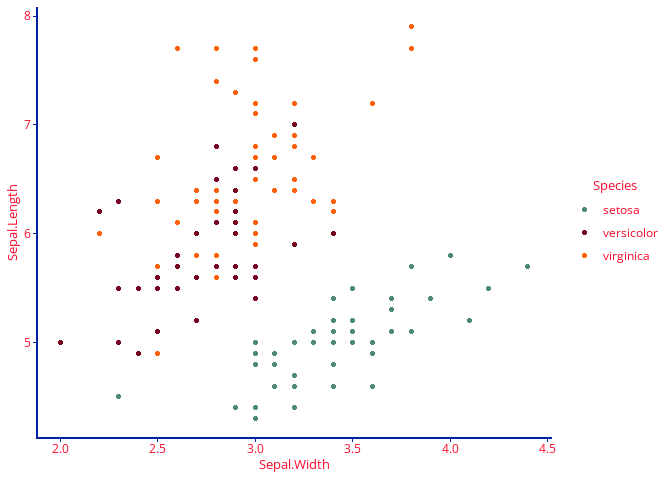

TNTools
================

# Overview

This package is a collection of convenience functions and data for TN
Department of Health users. There are several areas addressed, and more
may be added periodically:

-   Email: Helper functions for installing RDCOMClient and
    drafting/sending emails using Outlook
-   Geocoding: Functions which interface with the TN Geocoding API
    (needs work), as well as TN shapefiles
-   ggplot2: Themes, color palettes, and TN logos

### Download this package

``` r
devtools::install_github("TDH-SSI-Hub/TNTools")
library("TNTools")
```

If you can’t install this package, you likely need to install `devtools`
and/or the correct version of `rtools` for your R.

## Sending Emails

Sending Outlook emails in R is very useful, but the `RDCOMClient`
package which enables this is often not available for the current
versions of R on CRAN, and `RDCOMClient` is a very general interface to
many applications with syntax and documentation different from most
other R functions. This package helps you install `RDCOMClient` and
makes sending emails more intuitive. You also need Outlook on your
machine.

### Install `RDCOMClient`

`RDCOMClient` is not a dependency of `TNTools`, since the package is
often not available on CRAN for recent versions of R. You likely need to
install the package from github. I recommend the
[bschamberger](https://github.com/bschamberger/RDCOMClient) or
[omegahat](https://github.com/bschamberger/RDCOMClient) repositories.

``` r
email_setup()
```

`email_setup()` is designed to help install RDCOMClient.

### Sending emails

`email_send()` is a wrapper around `email_draft()`. They both take the
same parameters. By default, `email_draft` will open the email in the
visual editor without sending the email. In contrast, `email_send()`
defaults to sending an email without showing it in the visual editor.
Either function can act as the other if you change the `send` and
`visible` parameters.

``` r
# Send a basic email
email_send(to = 'example@gmail.com',
            subject = 'Automated Email',
            body='Final email body.'
           )
```

Each function also creates 2 objects in the global environment:

1.  `outApp` represents the Outlook Application

2.  `outMail` represents the created email

So you can use adapted methods and properties from the [Outlook VBA
guide](https://learn.microsoft.com/en-us/office/vba/api/overview/outlook)
to work with the email.

``` r
# Draft and open an email
email_draft(to = 'example@gmail.com',
            subject = 'Automated Email',
            body=''
            )
# Make manual edits in the Outlook visual editor

# Or make edits in R
outMail[['body']] <- 'Please do not respond'

# Send the email using RDCOMClient syntax
outMail$Send()
```

## TN Geocoding

The TN geocoding API should be used for geocoding whenever possible,
since it is updated monthly. The goal for this section of TNTools is to
make an easy interface to the geocoder. This area is under active
development.

## `ggplot2` and Branding

TN branding requirements specify certain fonts and colors for public
facing reports and dashboards. The `theme_tn()` function sets plot fonts
to Open Sans and simplifies the default theme.

``` r
ggplot(iris, aes(x=Sepal.Width,y=Sepal.Length)) +
  geom_point() +
  theme_tn()
```



In addition, you can set the color for various plot elements using the
function parameters. If a color is not branding compliant, a warning
will be generated.

``` r
#| warnings: false

ggplot(iris, aes(x=Sepal.Width,y=Sepal.Length)) +
  geom_point() +
  theme_tn(axis_line_color = 'OfficialBlue',
           axis_text_color = 'OfficialRed')
```



Official hex colors can be found using `tn_color_names()` or
`tn_colors_show()`. This function can be filtered by palette to make it
less crowded. It includes the hex code, palette, and TN specific names
for the colors.

``` r
tn_color_show()
```


### Color Palettes

Color palettes are also available for use. Use `tn_palette_show()` to
see them.

``` r
tn_palette_show()
```



These palettes can be used with another set of custom functions:
`scale_fill_tn()` and `scale_color_tn()`

``` r
ggplot(iris, aes(x=Sepal.Width,y=Sepal.Length, color=Species)) +
  geom_point() +
  scale_color_tn('Contrast') +
  theme_tn(axis_line_color = 'OfficialBlue',
           axis_text_color = 'OfficialRed')
```


