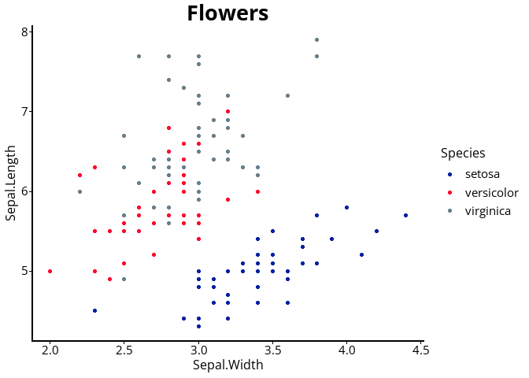
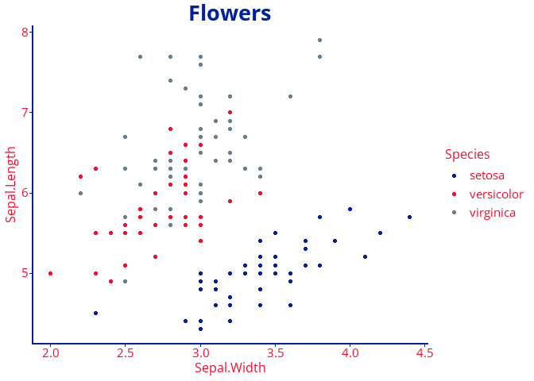

# TNTools

# Overview

This package is a collection of convenience functions and data for TN
Department of Health users. There are several areas addressed, and more
may be added periodically:

- Email: Helper functions for installing RDCOMClient and
  drafting/sending emails using Outlook
- Geocoding: Functions which interface with the TN Geocoding API (needs
  work), as well as TN shapefiles
- ggplot2: Themes, color palettes, and TN logos
- Data cleaning: Common data tasks, currently just date cleaning

### Download this package

``` r
devtools::install_github("TDH-SSI-Hub/TNTools")
library("TNTools")
```

If you can’t install this package, you likely need to install `devtools`
and/or the correct version of `rtools` for your R.

## Sending Emails

Sending Outlook emails in R is very useful, but the `RDCOMClient`
package which enables this is often not available for the current
versions of R on CRAN, and `RDCOMClient` is a very general interface to
many applications with syntax and documentation different from most
other R functions. This package helps you install `RDCOMClient` and
makes sending emails more intuitive. You also need Outlook on your
machine.

### Install `RDCOMClient`

`RDCOMClient` is not a dependency of `TNTools`, since the package is
often not available on CRAN for recent versions of R. You likely need to
install the package from github. I recommend the
[bschamberger](https://github.com/bschamberger/RDCOMClient) or
[omegahat](https://github.com/bschamberger/RDCOMClient) repositories.

``` r
email_setup()
```

`email_setup()` is designed to help install RDCOMClient.

### Sending emails

`email_send()` is a wrapper around `email_draft()`. They both take the
same parameters. By default, `email_draft` will open the email in the
visual editor without sending the email. In contrast, `email_send()`
defaults to sending an email without showing it in the visual editor.
Either function can act as the other if you change the `send` and
`visible` parameters.

``` r
# Send a basic email
email_send(to = 'example@gmail.com',
            subject = 'Automated Email',
            body='Final email body.'
           )
```

Each function also creates 2 objects in the global environment:

1.  `outApp` represents the Outlook Application

2.  `outMail` represents the created email

So you can use adapted methods and properties from the [Outlook VBA
guide](https://learn.microsoft.com/en-us/office/vba/api/overview/outlook)
to work with the email.

``` r
# Draft and open an email
email_draft(to = 'example@gmail.com',
            subject = 'Automated Email',
            body=''
            )
# Make manual edits in the Outlook visual editor

# Or make edits in R
outMail[['body']] <- 'Please do not respond'

# Send the email using RDCOMClient syntax
outMail$Send()
```

## TN Geocoding

The TN geocoding API should be used for geocoding whenever possible,
since it is updated monthly. `TNTools` includes functions which provide
an easy interface to the geocoder.

Currently, the only supported service is the geocode address
functionality - `tn_geocode_addresses()`. The first argument is a
dataframe with columns that can be used as inputs to the geocoder. The
`match_on` parameter specifies which columns are to be sent to the
geocoder, and what they represent. In the example below, the dataframe
has a street address column “locAddress”, so we specify that
`Address="locAddress"`. We do the same for city, but the state field is
already named correctly and doesn’t need to be named in the parameter.

``` r
tdh<-data.frame(locAddress='710 James Robertson Pwky'
           ,locCity='Nashville'
           ,State='TN')

tn_geocode_addresses(tdh, match_on = c(Address='locAddress'
                                       ,City='locCity'
                                       ,'State')
                     )
```

                    locAddress   locCity State Score
    1 710 James Robertson Pwky Nashville    TN 99.44
                                          Match_addr   County         X        Y
    1 710 JAMES ROBERTSON PKWY, NASHVILLE, TN, 37203 DAVIDSON -86.78719 36.16781

The default output includes the match score, match address, county, and
X/Y coordinates (longitude and latitude). You can specify the fields the
return by using the `return_fields` parameter. In addition to specific
parameters, you can use `'*'`,`'All'`,`''`, or `NA` to return all
fields, or `'None'` to return the default minimum fields.

``` r
tn_geocode_addresses(tdh, match_on = c(Address='locAddress'
                                       ,City='locCity'
                                       ,'State')
                     , return_fields = c('County','Postal')
                     )
```

                    locAddress   locCity State   County Postal
    1 710 James Robertson Pwky Nashville    TN DAVIDSON  37203

For a list of valid inputs and outputs use `tn_valid_inputs()` and
`tn_valid_outputs()`. By default, these return the parameters accepted
or returned by the geocoder. `tn_geocode_addresses()` can handle some
common aliases for important fields (e.g., ‘Street’ is recognized as
‘Address’). Running `tn_valid_inputs(special_cases=T)` or
`tn_valid_outputs(special_cases=T)` will include additional aliases you
can use with `tn_geocode_addresses()`. In the example below, we use
‘Street’ as an alias for ‘Address’ and ‘Zip’ instead of ‘Postal’.

``` r
tn_geocode_addresses(tdh, match_on = c(Street='locAddress'
                                       ,City='locCity'
                                       ,'State')
                     , return_fields = c('County','Zip')
                     )
```

                    locAddress   locCity State   County   Zip
    1 710 James Robertson Pwky Nashville    TN DAVIDSON 37203

### Health Regions

`tn_county_to_region()` allows you to use the county to derive the
health region. This is case-/space-insensitive and works whether or not
the strings contain ‘county’. This function relies on the `tn_counties`
dataframe, which is also included in the package.

``` r
tn_county_to_region(c('VanBuren','Van Buren','vanburen county','Sumner'))
```

    [1] "Upper Cumberland" "Upper Cumberland" "Upper Cumberland" "Mid-Cumberland"  

## `ggplot2` and Branding

TN branding requirements specify certain fonts and colors for public
facing reports and dashboards. The `theme_tn()` function sets plot fonts
to Open Sans and simplifies the default theme.

``` r
ggplot(iris, aes(x=Sepal.Width,y=Sepal.Length, color=Species)) +
  geom_point() +
  ggtitle('Flowers') +
  theme_tn()
```


In addition, you can set the color for various plot elements using the
function parameters. If a color is not branding compliant, a warning
will be generated.

``` r
#| warnings: false

flowers<-ggplot(iris, aes(x=Sepal.Width,y=Sepal.Length, color=Species)) +
  geom_point() +
  ggtitle('Flowers') +
  theme_tn(axis_line_color = 'OfficialBlue',
           axis_text_color = 'OfficialRed',
           title_color = 'OfficialBlue') 

flowers
```


Official hex colors can be found using `tn_color_names()` or
`tn_colors_show()`. This function can be filtered by palette to make it
less crowded. It includes the hex code, palette, and TN specific names
for the colors.

``` r
tn_color_show()
```



### Color Palettes

Color palettes are also available for use. Use `tn_palette_show()` to
see them.

``` r
tn_palette_show()
```



These palettes can be used with another set of custom functions:
`scale_fill_tn()` and `scale_color_tn()`

``` r
flowers +
  scale_color_tn('Contrast')
```


For continuous scales, use `discrete=FALSE`. This will result in colors
on the plot which do not conform to the branding standard because
intermediate colors are interpolated from the chosen palette.

Finally, the `add_tn_logo()` function can place one of several onto a
plot object. The logo can be specified as a string from
`tn_logo_names()` and the position can be on the top or bottom of the
plot, in the left, right, or center (using the `position` parameter).

``` r
add_tn_logo(flowers,"TN Dept of Health Color", position = 'top right')
```


## Data Cleaning

The `tn_clean_date()` combines 3 date parsing techniques: -
`anytime::anydate()` - `parsedate::parse_date()` -
`as.Date(x, origin = "1899-12-30")` for Excel dates formatted as a
number

``` r
bad_dates<-c('1 Feb 2020','2/2/20','February 3rd 2020','43865.00
')

tn_clean_date(bad_dates)
```

    [1] "2020-02-01" "2020-02-02" "2020-02-03" "2020-02-04"

The default return value will be a date vector, but you can also specify
an output format acceptable to `format()` to return a string.

``` r
tn_clean_date(bad_dates, format='%m/%d/%Y')
```

    [1] "02/01/2020" "02/02/2020" "02/03/2020" "02/04/2020"
